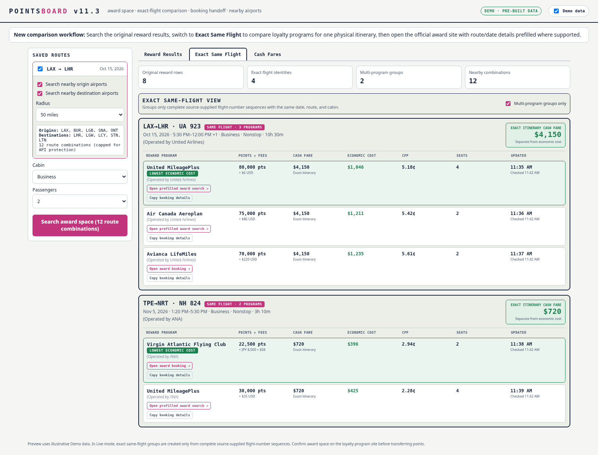

# PointsBoard v11.3 Feature Guide

This guide supplements the illustrated v11.2.1 GitHub and Cloudflare setup guide. Deployment steps are unchanged. This guide explains the three new user workflows.



## Workflow map

```text
Saved route
    │
    ├─ Optional nearby-origin / nearby-destination expansion
    │       │
    │       └─ Bounded route combinations
    │
    └─ Search award space
            │
            ├─ Reward Results
            ├─ Recommended Redemptions
            ├─ Exact Same Flight
            │      └─ Compare loyalty programs for one flight
            └─ Cash Fares

Exact Same Flight row
    │
    ├─ Compare cash fare
    ├─ Compare economic cost
    ├─ Compare points, fees, CPP, seats, update time
    └─ Open official award site or copy booking details
```

## 1. Compare the same flight across loyalty programs

1. Select a saved route and run the normal award search.
2. Open the **Exact Same Flight** tab.
3. Leave **Multi-program groups only** checked to see only flights bookable through more than one selected loyalty program.
4. Compare each loyalty row.

### What counts as an exact group

PointsBoard requires the same:

- date;
- origin and destination;
- cabin;
- complete source-supplied flight-number sequence.

A row with missing flight numbers is not combined with another row. This conservative rule avoids falsely claiming two similar schedules are the same physical flight.

### Cash fare is not economic cost

- **Cash fare** is the live cash price or labeled benchmark associated with the award itinerary.
- **Economic cost** is the estimated value of points consumed plus USD-converted award taxes and fees.

The same-flight view displays both. A flight can have the same cash fare through several loyalty programs while each program has a different economic cost.

### Interpret the winner

The green **Lowest economic cost** label identifies the least economically expensive loyalty-program option for that exact group. It does not automatically mean:

- the fewest points;
- the lowest cash fees;
- the greatest number of seats;
- the best transfer partner for your personal balances.

Review all columns before booking.

## 2. Open the official award-booking site

Each reward option includes:

- **Open prefilled award search** — used when PointsBoard has a best-effort official URL adapter;
- **Open award booking** — opens the official loyalty-program award page when a stable prefilled URL is not dependable;
- **Copy booking details** — copies the route, date, passenger count, cabin, source-supplied flight numbers, operating carrier codes, points, and taxes.

### Recommended procedure

1. Click the official award button.
2. Sign in if required.
3. Confirm the route, date, passengers, and cabin.
4. Paste the copied booking details if the airline did not retain the prefilled values.
5. Confirm the exact flight and award price.
6. Transfer bank points only after confirming bookable award space.

Airline sites can change URLs, require temporary session tokens, or discard parameters after login. The copyable booking packet is therefore an intentional fallback rather than an error.

## 3. Search nearby airports

Nearby-airport controls appear inside each saved-route card.

### Basic use

1. Check **Nearby origin**, **Nearby destination**, or both.
2. Choose a radius of 25, 50, or 100 miles.
3. Review the listed airports and route-combination count.
4. Run the award search.

PointsBoard uses curated metropolitan groups first, then supplements them with airports found by coordinate distance. This prevents a simple radius from excluding a practical city airport merely because it is slightly farther away.

### Example

```text
Base route: LAX → LHR

Nearby origins:
LAX, BUR, LGB, SNA, ONT

Nearby destinations:
LHR, LGW, LCY, STN, LTN

Raw combinations: 25
Search combinations used: 12
```

The cap protects API quota and response time. The interface shows when a search has been truncated.

### Guardrails

- Five airports maximum on each side.
- Twelve expanded combinations per saved route.
- Thirty total expanded combinations across selected routes.
- Four concurrent live route requests.
- Duplicate combinations removed.
- Actual origin and destination remain visible on every returned result.

## Demo and Live behavior

### Demo mode

- Uses only pre-built rows.
- Makes no award or cash-fare provider request.
- Nearby combinations without matching Demo fixtures return no synthetic results.

### Live mode

- Searches only provider-backed data.
- Does not substitute Demo rows.
- Does not create a synthetic cash fare when the cash provider is unavailable.

## Troubleshooting

### No multi-program groups appear

Possible causes:

- only one program returned the flight;
- another program did not supply complete flight numbers;
- cabin or other filters removed one of the program rows;
- the schedules look similar but the source flight-number sequences differ.

Turn off **Multi-program groups only** to inspect exact single-program identities and unverified rows.

### The award site did not retain the date

Use **Copy booking details**, reopen the official award site, and enter the copied values manually. Prefill behavior is controlled by the airline website and can change.

### Nearby search generated fewer routes than expected

The combination cap protects API quota. Reduce the airport radius, disable one side, or search one saved route at a time.

### Cash fare differs between loyalty rows for the same flight

Review each row's fare-provenance label. An exact itinerary match is stronger than a same-airline or route/cabin benchmark. PointsBoard does not hide those differences.
